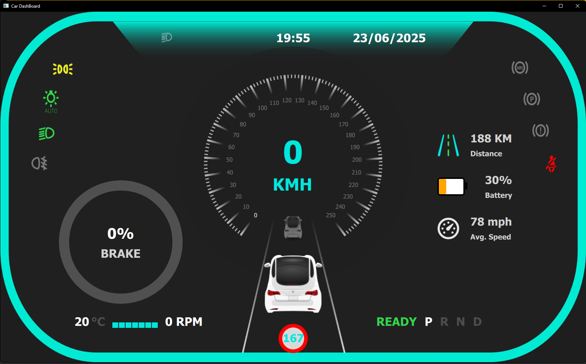

<!-- Improved compatibility of back to top link: See: https://github.com/othneildrew/Best-README-Template/pull/73 -->
<a id="readme-top"></a>
<!--
*** Thanks for checking out the Best-README-Template. If you have a suggestion
*** that would make this better, please fork the repo and create a pull request
*** or simply open an issue with the tag "enhancement".
*** Don't forget to give the project a star!
*** Thanks again! Now go create something AMAZING! :D
-->


<!-- PROJECT SHIELDS -->
<!--
*** I'm using markdown "reference style" links for readability.
*** Reference links are enclosed in brackets [ ] instead of parentheses ( ).
*** See the bottom of this document for the declaration of the reference variables
*** for contributors-url, forks-url, etc. This is an optional, concise syntax you may use.
*** https://www.markdownguide.org/basic-syntax/#reference-style-links
-->

<!-- PROJECT LOGO -->
<br />
<div align="center">
  <a href="https://github.com/KOB01D/E-Kart-Display.git">
    
  </a>

<h3 align="center">E-Kart-Display</h3>

 
</div>


<!-- TABLE OF CONTENTS -->
<details>
  <summary>Table of Contents</summary>
  <ol>
    <li>
      <a href="#about-the-project">About The Project</a>
    </li>
    <li>
      <a href="#getting-started">Getting Started</a>
      <ul>
        <li><a href="#prerequisites">Prerequisites</a></li>
        <li><a href="#installation">Installation</a></li>
      </ul>
    </li>
    <li><a href="#Startup on boot">Usage</a></li>
    <li><a href="#Adding power button">Roadmap</a></li>
  </ol>
</details>


<!-- ABOUT THE PROJECT -->
## About The Project


The original project is from https://github.com/cppqtdev/Qt-HMI-Display-UI and built using Qt Qml. I have made a few adjustments and some new features to make it suitable for my application. I will also show how I use a Raspberry Pi 4 to run the program and make it run on boot. 

<p align="right">(<a href="#readme-top">back to top</a>)</p>


<!-- GETTING STARTED -->
## Getting Started

For this project, I use Raspberry Pi 4 with Debian 10 installed and an 800x480 touchscreen display from Elecrow.

### Prerequisites

Install Qt5 for Raspberry Pi.
* Qt5
  ```sh
  sudo apt install qt5-default qtbase5-dev qtdeclarative5-dev libqt5svg5-dev qml-module-qtquick-controls qml-module-qtquick-controls2 qml-module-qtgraphicaleffects qml-module-qtquick-xmllistmodel -y

  ```

### Installation

1. Clone the repo
   ```sh
   https://github.com/KOB01D/E-Kart-Display.git
   ```
2. Go to the project directory
   ```sh
   cd /home/YOUR_DIRECTORY
   ```
3. compile the project
   ```sh
   qmake
   make -j
   ```
4. Run the project
   ```sh
   ./Car_1
   ```

<p align="right">(<a href="#readme-top">back to top</a>)</p>


<!-- STARTUP ON BOOT -->
## Startup on boot

In this section, I will show how I program the Raspberry Pi to start on boot using Kiosk mode with X11.

1. Install Unclutter to hide the mouse cursor.
   ```sh
   sudo apt-get install unclutter
   ```
2. Write a shell script to run the program in Kiosk mode.
   ```sh
   nano run_kiosk.sh
   ```
3. Write this code in the `run_kiosk.sh`.
   ```sh
   sleep 4
   ./YOUR_DIRECTORY/Car_1 --kiosk --start-maximized --noerrdialogs --disable-infobars
   ```
4. Make the file executable. 
   ```sh
   chmod +x run_kiosk.sh
   ```
5. Open the autostart file to make a few adjustments so that Pi will run our `run_kiosk.sh` on boot.
    ```sh
    sudo nano /etc/xdg/lxsession/LXDE-pi/autostart
    ```
6. Write this code in the autostart file.
   ```sh
   @xset s off
   @xset s noblank
   @xset -dpms
   @unclutter-idle 3 -root
   @/home/pi/run_kiosk.sh
   ```
7. Now the pi is ready and will run the program on boot.


<p align="right">(<a href="#readme-top">back to top</a>)</p>

<!-- ADD POWER BUTTON -->
## Adding power button

In this section, I will show how to add a power button to turn on and off the Raspberry Pi.

1. In order to work, we need to use a push button.
2. Connect the pin to GPIO 3 and ground at the Raspberry Pi

   

3. Open config.txt using nano.
   ```sh
   sudo nano /boot/config.txt
   ```
4. Add this code at the end of the line.
   ```sh
   #Power button
   dtoverlay=gpio-shutdown
   ```
5. Now the Raspberry Pi can be turned on and off using an external push button. 
 


<p align="right">(<a href="#readme-top">back to top</a>)</p>


<!-- CONTACT -->
## Contact

Your Name - danish.haikal.sapari@gmail.com

Project Link: [https://github.com/KOB01D/E-Kart-Display.git](https://github.com/KOB01D/E-Kart-Display)

<p align="right">(<a href="#readme-top">back to top</a>)</p>


